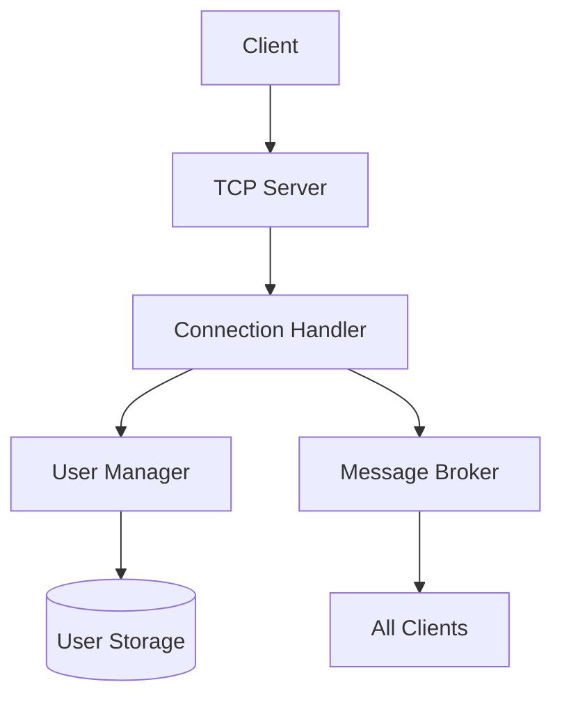

# TCP Chat Server Documentation

## English Version

### Overview
A multi-threaded TCP chat server built with Rust and Tokio, supporting:
- Multiple concurrent clients
- Nickname management (`/nick` command)
- Message broadcasting
- Connection lifecycle management

### Features
- 🚀 Async I/O using Tokio
- 🔒 Thread-safe resource management
- 👥 User session tracking
- 📡 Message broadcasting
- 💻 Cross-platform support

### Requirements
- Rust 1.65+
- Tokio runtime
- Linux/macOS/Windows

### Installation
```bash
git clone https://github.com/yourusername/tcp-chat.git
cd tcp-chat
cargo build --release
```

### Usage
Start server:
```bash
cargo run --release
```

Connect clients:
```bash
telnet localhost 8080
```

Available commands:
- `/nick <new_name>` - Change your nickname

### Project Structure
```text
src/
├── main.rs          # Server entry point
├── clients/         # User management
├── handlers/        # Connection handlers
├── network/         # Network utilities
└── lib/             # Core functionality
```

## Руссийская Версия

### Обзор
Многопоточный TCP чат-сервер на Rust с использованием Tokio:
- Поддержка множества клиентов
- Управление никнеймами (`/nick`)
- Широковещательная рассылка сообщений
- Управление подключениями

### Особенности
- 🚀 Асинхронный ввод/вывод на Tokio
- 🔒 Потокобезопасное управление ресурсами
- 👥 Отслеживание пользовательских сессий
- 📡 Широковещательная рассылка сообщений
- 💻 Кроссплатформенная поддержка

### Требования
- Rust 1.65+
- Среда выполнения Tokio
- Linux/macOS/Windows

### Установка
```bash
git clone https://github.com/yourusername/tcp-chat.git
cd tcp-chat
cargo build --release
```

### Использование
Запуск сервера:
```bash
cargo run --release
```

Подключение клиентов:
```bash
telnet localhost 8080
```

Доступные команды:
- `/nick <новое_имя>` - Сменить никнейм

### Структура Проекта
```text
src/
├── main.rs          # Точка входа сервера
├── clients/         # Управление пользователями
├── handlers/        # Обработчики подключений
├── network/         # Сетевые утилиты
└── lib/             # Основная функциональность
```

### Architecture Diagram

